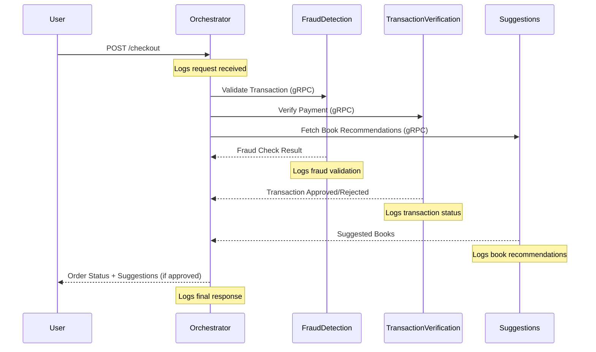
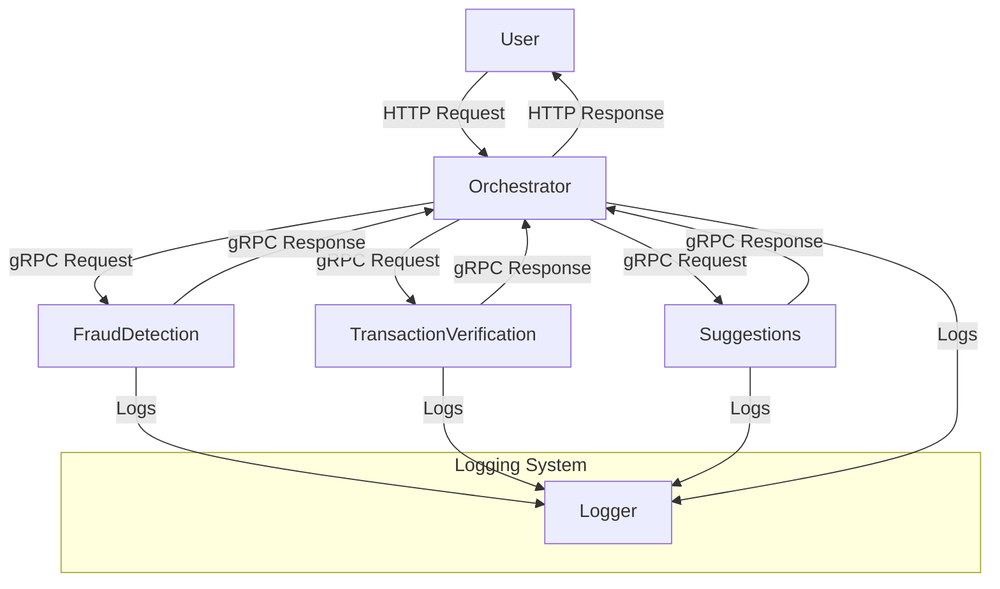

# Project Documentation

## Overview
This project implements a **microservices-based architecture** using **gRPC** and **Flask** to facilitate transaction validation and book recommendation services. The system consists of multiple services communicating over gRPC, with an **Orchestrator API** acting as a central gateway.

## Services Overview

### 1. **Fraud Detection Service (`fraud_detection`)**
- Validates transactions by analyzing user and credit card information.
- Determines if a transaction is fraudulent.

### 2. **Transaction Verification Service (`transaction_verification`)**
- Verifies the validity of a credit card and purchase details.
- Ensures transaction integrity.

### 3. **Book Suggestions Service (`suggestions`)**
- Recommends books based on user purchases.

### 4. **Orchestrator Service (`orchestrator`)**
- Manages and coordinates requests across all services.
- Exposes an HTTP API (`/checkout`) using **Flask**.
- Calls fraud detection, transaction verification, and book suggestion services in parallel.

---

## Project Structure
```
.
├── README.md
├── docker-compose.yaml
├── docs
│   └── README.md
├── fraud_detection
│   ├── Dockerfile
│   ├── requirements.txt
│   └── src
│       └── app.py
├── frontend
│   ├── Dockerfile
│   └── src
│       └── index.html
├── orchestrator
│   ├── Dockerfile
│   ├── requirements.txt
│   └── src
│       └── app.py
├── suggestions
│   ├── Dockerfile
│   ├── requirements.txt
│   └── src
│       └── app.py
├── transaction_verification
│   ├── Dockerfile
│   ├── requirements.txt
│   └── src
│       └── app.py
├── utils
│   ├── README.md
│   ├── api
│   │   ├── bookstore.yaml
│   │   ├── fintech.yaml
│   │   └── ridehailing.yaml
│   ├── other
│   │   └── hotreload.py
│   └── pb
│       ├── fraud_detection
│       │   ├── __init__.py
│       │   ├── fraud_detection.proto
│       │   ├── fraud_detection_pb2.py
│       │   ├── fraud_detection_pb2.pyi
│       │   └── fraud_detection_pb2_grpc.py
│       ├── suggestions
│       │   ├── __init__.py
│       │   │   ├── suggestions_pb2.cpython-311.pyc
│       │   │   └── suggestions_pb2_grpc.cpython-311.pyc
│       │   ├── suggestions.proto
│       │   ├── suggestions_pb2.py
│       │   ├── suggestions_pb2.pyi
│       │   └── suggestions_pb2_grpc.py
│       └── transaction_verification
│           ├── __init__.py
│           ├── transaction_verification.proto
│           ├── transaction_verification_pb2.py
│           ├── transaction_verification_pb2.pyi
│           └── transaction_verification_pb2_grpc.py
└── variables.env
```
---

## Service Communication Flow

1. The **Orchestrator Service** receives a **checkout request** via HTTP.
2. It generates a **correlation ID** and calls:
   - **Fraud Detection Service** to check if the transaction is fraudulent.
   - **Transaction Verification Service** to validate credit card details.
   - **Suggestions Service** to provide book recommendations.
3. These calls run **concurrently** using a `ThreadPoolExecutor`.
4. Responses from all services are aggregated:
   - If fraud detection or transaction verification fails → **Order is Rejected**.
   - If successful → **Order is Approved**, and book suggestions are returned.
5. The final response is sent back to the client.

---

## API Endpoints

| Endpoint       | Method | Description |
|---------------|--------|-------------|
| `/checkout`   | `POST` | Handles checkout by validating transactions and suggesting books |

### Example Checkout Request:

```json
{
  "user": {
    "name": "Alice Doe",
    "contact": "alice@example.com"
  },
  "creditCard": {
    "number": "4111111111111111",
    "expirationDate": "12/24",
    "cvv": "123"
  },
  "items": [
    {
      "name": "Machine Learning Basics",
      "quantity": 1
    }
  ]
}
```
### Example Response:
```json
{
  "orderId": "12345",
  "status": "Order Approved",
  "suggestedBooks": [
    {
      "bookId": "567",
      "title": "Deep Learning Fundamentals",
      "author": "Jane Smith"
    }
  ]
}
```

## System Diagram


## Architecture Diagram



## Project Contributors

| Name             | Email             |
|-----------------|------------------|
| **Ahmed Soliman** | soliman@ut.ee    |
| **Buraq Khan**   | buraq@ut.ee      |

