---

# Project Documentation

## Overview
This project implements a **microservices-based architecture** using **gRPC** and **Flask** to facilitate transaction validation and book recommendation services. The system consists of multiple services communicating over gRPC, with an **Orchestrator API** acting as a central gateway.

## Services Overview

### 1. **Fraud Detection Service (`fraud_detection`)**
- Analyzes user and credit card details.
- Uses both rule-based checks (e.g., card velocity) and advanced AI analysis.
- Logs every step with a standardized format.
- Returns a simple approval decision based on high-confidence fraud signals.

### 2. **Transaction Verification Service (`transaction_verification`)**
- Validates transaction details such as item information, credit card format, Luhn algorithm check, and shipping method.
- Logs validation results concisely.
- Returns an approval status along with a clear rejection message when needed.

### 3. **Book Suggestions Service (`suggestions`)**
- Provides book recommendations based on the user's purchase.
- Calls OpenAI’s GPT model to generate suggestions and formats them as a JSON array.
- Uses consistent logging for AI prompt and response handling.

### 4. **Orchestrator Service (`orchestrator`)**
- Acts as the API gateway using Flask.
- Receives checkout requests, generates a unique correlation ID, and concurrently calls the Fraud Detection, Transaction Verification, and Book Suggestions services.
- Aggregates responses:
  - If either Fraud Detection or Transaction Verification rejects the order, a clear rejection message is set.
  - If both approve, the order is approved and book suggestions are included.
- Always returns a `"suggestedBooks"` key (an empty array if no suggestions) to maintain a consistent API response.
- Logs each step with a uniform and concise format.

---

## Project Structure

```
.
├── README.md
├── docker-compose.yaml
├── docs
│   └── README.md
├── fraud_detection
│   ├── Dockerfile
│   ├── requirements.txt
│   └── src
│       └── app.py
├── frontend
│   ├── Dockerfile
│   └── src
│       └── index.html
├── orchestrator
│   ├── Dockerfile
│   ├── requirements.txt
│   └── src
│       └── app.py
├── suggestions
│   ├── Dockerfile
│   ├── requirements.txt
│   └── src
│       └── app.py
├── transaction_verification
│   ├── Dockerfile
│   ├── requirements.txt
│   └── src
│       └── app.py
└── utils
    ├── README.md
    ├── api
    │   ├── bookstore.yaml
    │   ├── fintech.yaml
    │   └── ridehailing.yaml
    ├── other
    │   └── hotreload.py
    └── pb
        ├── fraud_detection
        │   ├── __init__.py
        │   ├── fraud_detection.proto
        │   ├── fraud_detection_pb2.py
        │   ├── fraud_detection_pb2.pyi
        │   └── fraud_detection_pb2_grpc.py
        ├── suggestions
        │   ├── __init__.py
        │   ├── suggestions.proto
        │   ├── suggestions_pb2.py
        │   ├── suggestions_pb2.pyi
        │   └── suggestions_pb2_grpc.py
        └── transaction_verification
            ├── __init__.py
            ├── transaction_verification.proto
            ├── transaction_verification_pb2.py
            ├── transaction_verification_pb2.pyi
            └── transaction_verification_pb2_grpc.py
```

---

## Service Communication Flow

1. The **Orchestrator Service** receives a **checkout request** via an HTTP POST to `/checkout`.
2. It generates a unique **correlation ID** and concurrently calls:
   - **Fraud Detection Service** (to analyze the transaction for potential fraud).
   - **Transaction Verification Service** (to validate credit card and purchase details).
   - **Book Suggestions Service** (to generate book recommendations).
3. Responses are aggregated:
   - **Rejection:** If either Fraud Detection or Transaction Verification fails, the order is rejected with a clear reason (e.g., "Order Rejected: Fraud detection failed" or a specific transaction verification message).
   - **Approval:** If both services approve, the order is approved and book suggestions are attached.
4. The final response is returned to the client in a consistent JSON structure that always includes the `"suggestedBooks"` key.

---

## API Endpoints

| Endpoint       | Method | Description |
|----------------|--------|-------------|
| `/checkout`    | `POST` | Validates transactions and returns order status with book suggestions if approved |

### Example Checkout Request:

```json
{
  "user": {
    "name": "Alice Doe",
    "contact": "alice@example.com"
  },
  "creditCard": {
    "number": "4111111111111111",
    "expirationDate": "12/24",
    "cvv": "123"
  },
  "items": [
    {
      "name": "Machine Learning Basics",
      "quantity": 1
    }
  ]
}
```

### Example Response:

If the order is approved:

```json
{
  "orderId": "12345",
  "status": "Order Approved",
  "suggestedBooks": [
    {
      "bookId": "567",
      "title": "Deep Learning Fundamentals",
      "author": "Jane Smith"
    }
  ]
}
```

If the order is rejected (note the empty `"suggestedBooks"` array):

```json
{
  "orderId": "12345",
  "status": "Order Rejected: Fraud detection failed",
  "suggestedBooks": []
}
```

---

## System Diagram


### Architecture Diagram

```mermaid
graph TD;
    User["👤 User"] -->|HTTP Request| Orchestrator[🟢 Orchestrator API :5000];
    
    Orchestrator -->|gRPC :50051| FraudDetection[🔍 Fraud Detection Service];
    Orchestrator -->|gRPC :50052| TransactionVerification[💳 Transaction Verification Service];
    Orchestrator -->|gRPC :50053| Suggestions[📚 Book Suggestions Service];

    FraudDetection -->|gRPC| OpenAI[🤖 OpenAI];
    Suggestions -->|gRPC| OpenAI;

    FraudDetection -->|gRPC Response| Orchestrator;
    TransactionVerification -->|gRPC Response| Orchestrator;
    Suggestions -->|gRPC Response| Orchestrator;
    
    Orchestrator -->|HTTP Response| User;
    
    %% Logging System
    subgraph Logging ["📝 Logging System"]
        Logger
    end

    FraudDetection -->|Logs| Logger;
    TransactionVerification -->|Logs| Logger;
    Suggestions -->|Logs| Logger;
    Orchestrator -->|Logs| Logger;
```

---

## Project Contributors

| Name              | Email             |
|-------------------|-------------------|
| **Ahmed Soliman** | soliman@ut.ee     |
| **Buraq Khan**    | buraq@ut.ee       |
