# E-Commerce Checkout System

## Overview
This project implements a **microservices-based architecture** using **gRPC** and **Flask** to facilitate transaction validation and book recommendation services. The system consists of multiple services communicating over gRPC, with an **Orchestrator API** acting as a central gateway.

## Services Overview

1. **Frontend**
   - Provides checkout interface for customers
   - Submits orders to the orchestrator
   - Displays order status and book recommendations

2. **Orchestrator**
   - Coordinates the checkout workflow using Flask
   - Manages vector clocks for causal consistency
   - Routes events to appropriate services following DAG dependencies
   - Enqueues approved orders for processing

3. **Transaction Verification**
   - Validates transaction data integrity
   - Verifies items and quantities
   - Checks user data completeness
   - Validates credit card format and expiration

4. **Fraud Detection**
   - Evaluates transactions for potential fraud using AI
   - Performs OpenAI-powered analysis of user data patterns
   - Implements confidence-based approval system for AI judgments
   - Checks credit card velocity (frequency of use) to detect suspicious activity
   - Falls back to rule-based checks when AI is unavailable

5. **Suggestions**
   - Provides personalized book recommendations using AI
   - Leverages OpenAI to generate contextually relevant book suggestions
   - Analyzes purchased items to generate relevant recommendations
   - Implements fallback mechanisms for AI service failures

6. **Order Queue**
   - Buffers approved orders for processing
   - Maintains priority-based order queue
   - Provides queue status information
   - Ensures orders wait for processing in priority order

7. **Order Executor Cluster**
   - Three executor instances implementing the Raft Algorithm
   - Processes orders from the queue when elected as leader
   - Maintains high availability through redundancy


## System Model

### Communication Model
- **Synchronous gRPC Communication**: Services communicate through synchronous gRPC calls with protocol buffers
- **Vector Clock Propagation**: All services use vector clocks to track causality between distributed events  
- **Request Correlation**: Each request is tracked with a unique correlation ID across service boundaries
- **Service Discovery**: Services locate each other via container names in the Docker network

### Architectural Model
- **Microservices Architecture**: System composed of independent, specialized services
- **API Gateway Pattern**: Orchestrator coordinates workflow and manages client interaction
- **Event-Driven Processing**: System follows a directed acyclic graph (DAG) of events with dependencies
- **Service-Local State**: Each service maintains its own cache of order data
- **Docker Containerization**: All components run as containers managed by Docker Compose

### Timing Model
- **Vector Clocks**: Each service maintains a vector clock to track event causality
- **Event Dependencies**: Events follow a partial ordering determined by the directed acyclic graph
- **Clock Synchronization**: Services merge vector clocks during communication
- **Election Timeouts**: Order executors use randomized timeouts (1.5-3 seconds) for election initiation

### Failure Model
- **Service Not Found Handling**: System checks for missing data/services and handles errors gracefully
- **Vector Clock Conflict Detection**: System detects vector clock causality violations
- **Leader Election**: Order executor cluster implements the Raft Algorithm for leader election
- **Heartbeat Monitoring**: Leaders send periodic heartbeats (every 500ms) to maintain leadership
- **Graceful AI Degradation**: System continues processing even if AI services fail or return unexpected results


## Project Structure

```
project/
├── orchestrator/
│   ├── Dockerfile
│   └── src/
│       └── app.py             # API gateway and workflow coordinator
├── transaction_verification/
│   ├── Dockerfile
│   └── src/
│       └── app.py             # Transaction validation service
├── fraud_detection/
│   ├── Dockerfile
│   └── src/
│       └── app.py             # AI-powered fraud detection service
├── suggestions/
│   ├── Dockerfile
│   └── src/
│       └── app.py             # AI-powered book recommendations service
├── order_queue/
│   ├── Dockerfile
│   └── src/
│       └── app.py             # Order queue service
├── order_executor/
│   ├── Dockerfile
│   └── src/
│       └── app.py             # Order executor with Raft Algorithm
├── frontend/
│   ├── Dockerfile
│   └── src/
│       └── index.html         # Checkout form UI
├── utils/
│   └── pb/                    # Protocol buffer definitions
│       ├── fraud_detection/
│       │   ├── fraud_detection.proto
│       │   └── ...
│       ├── transaction_verification/
│       │   ├── transaction_verification.proto
│       │   └── ...
│       ├── suggestions/
│       │   ├── suggestions.proto
│       │   └── ...
│       ├── order_queue/
│       │   ├── order_queue.proto
│       │   └── ...
│       └── order_executor/
│           ├── order_executor.proto
│           └── ...
├── docker-compose.yaml        # Service orchestration
└── variables.env              # Environment variables including OpenAI API key
```

## Service Communication Flow

1. **Initialization Phase**:
   - Orchestrator receives HTTP checkout request
   - Generates unique order ID and correlation ID
   - Initializes all services in parallel with order data
   - Each service caches data and responds with updated vector clock
   - Orchestrator merges vector clocks

2. **Event Execution Phase**:
   - **Events a & b** (parallel): Verify items and user data
   - **Events c & d** (parallel, after a & b): Verify credit card format and check user data
   - **Event d** uses AI to analyze user data for fraud patterns
   - **Event e** (after c & d): Check credit card for fraud with velocity checks
   - **Event f** (after e): Get AI-generated book suggestions
   - Each event updates and propagates vector clocks

3. **Order Processing Phase**:
   - Orchestrator checks if order executor cluster has a leader
   - Enqueues approved order in order queue
   - Leader in order executor cluster dequeues and processes order

4. **Cleanup Phase**:
   - Orchestrator sends final vector clock to all services
   - Services clear cached order data if vector clock indicates all events are complete

## AI Integration

### Fraud Detection AI
- **Model**: Uses OpenAI's GPT-4o-mini model
- **Prompt Engineering**: Structured prompts with clear JSON response formats
- **Confidence Scoring**: AI provides confidence level with each fraud assessment
- **Low-Confidence Handling**: Orders with low-confidence fraud indicators are approved but logged
- **Fallback Mechanism**: System continues with rule-based checks when AI service fails

### Recommendations AI 
- **Model**: Uses OpenAI's GPT-4o-mini model
- **Personalization**: Generates book recommendations based on purchased items
- **JSON Structure**: Returns structured data with book titles, authors, and IDs
- **Error Handling**: Implements fallback recommendations when AI response parsing fails

## API Endpoints

### POST /checkout

| Endpoint       | Method | Description |
|----------------|--------|-------------|
| `/checkout`    | `POST` | Validates transactions and returns order status with book suggestions if approved |
## Example Checkout Request

```json
{
  "items": [
    {
      "name": "Clean Architecture",
      "quantity": 1
    }
  ],
  "user": {
    "name": "John Doe",
    "contact": "john@example.com"
  },
  "creditCard": {
    "number": "4111111111111111",
    "expirationDate": "12/2025",
    "cvv": "123"
  },
  "billingAddress": {
    "street": "123 Main St",
    "city": "Anytown",
    "state": "CA",
    "zip": "12345",
    "country": "USA"
  },
  "shippingMethod": "standard",
  "giftWrapping": false,
  "termsAndConditionsAccepted": true
}
```

## Example Response

```json
{
  "orderId": "f47ac10b-58cc-4372-a567-0e02b2c3d479",
  "status": "Order Approved",
  "message": "Your order has been approved. Order has been queued for processing.",
  "suggestedBooks": [
    {
      "title": "Domain-Driven Design",
      "author": "Eric Evans",
      "category": "Software Engineering"
    },
    {
      "title": "Patterns of Enterprise Application Architecture",
      "author": "Martin Fowler",
      "category": "Software Engineering"
    },
    {
      "title": "Clean Code",
      "author": "Robert C. Martin",
      "category": "Software Engineering"
    }
  ],
  "finalVectorClock": {
    "orchestrator": 1,
    "transaction_verification": 4,
    "fraud_detection": 3,
    "suggestions": 2
  }
}
```

## System Diagram


## Architecture Diagram

```mermaid
graph TD;
    User["👤 User"] -->|HTTP Request| Orchestrator[🟢 Orchestrator API :5000];
    
    Orchestrator -->|gRPC :50052| TransactionVerification[💳 Transaction Verification Service];
    Orchestrator -->|gRPC :50051| FraudDetection[🔍 AI Fraud Detection Service];
    Orchestrator -->|gRPC :50053| Suggestions[📚 AI Book Suggestions Service];
    
    FraudDetection -->|API Call| OpenAI[☁️ OpenAI GPT API];
    Suggestions -->|API Call| OpenAI;
    
    Orchestrator -->|gRPC :50054| OrderQueue[📋 Order Queue Service];
    OrderQueue -->|gRPC :50055| OrderExecutor1[⚙️ Order Executor 1];
    OrderQueue -->|gRPC :50055| OrderExecutor2[⚙️ Order Executor 2];
    OrderQueue -->|gRPC :50055| OrderExecutor3[⚙️ Order Executor 3];
    
    OrderExecutor1 -.->|Raft Consensus| OrderExecutor2;
    OrderExecutor2 -.->|Raft Consensus| OrderExecutor3;
    OrderExecutor3 -.->|Raft Consensus| OrderExecutor1;
    
    TransactionVerification -->|gRPC Response| Orchestrator;
    FraudDetection -->|gRPC Response| Orchestrator;
    Suggestions -->|gRPC Response| Orchestrator;
    
    Orchestrator -->|HTTP Response| User;
```




## Leader Election Diagram

The order executor instances implement the Raft consensus algorithm for leader election:

### Sequence 1: Initial Election


### Sequence 2: Leader Failure and Re-election


### Sequence 3: Network Partition and Recovery


The Raft leader election algorithm ensures:
1. Only one leader exists in a given term
2. Leaders maintain authority through regular heartbeats
3. Nodes step down when discovering higher terms
4. The system recovers automatically after failures
5. Only the leader processes orders from the queue
6. Split votes are resolved through randomized timeouts
7. Network partitions are handled when healed

---

## Project Contributors

| Name              | Email             |
|-------------------|-------------------|
| **Ahmed Soliman** | soliman@ut.ee     |
| **Buraq Khan**    | buraq@ut.ee       |