# E-Commerce Checkout System


## Overview
This project implements a **microservices-based architecture** using **gRPC** and **Flask** to facilitate an end-to-end e-commerce checkout process. The system handles initial order validation, fraud detection, book suggestions, and then proceeds to order execution involving a payment service and a replicated book inventory database. Key features include distributed leader election (Raft), a priority order queue, vector clocks for causality in the validation phase, and a Two-Phase Commit (2PC) protocol for distributed transaction integrity during order execution.

## Services Overview

1.  **Frontend**
    *   Provides checkout interface for customers.
    *   Submits orders to the Orchestrator.
    *   Displays order status and (AI-generated) book recommendations.

2.  **Orchestrator**
    *   Acts as an API Gateway, receiving checkout requests via Flask.
    *   Coordinates the initial order validation workflow (transaction verification, fraud detection, suggestions) using a DAG of events and vector clocks for causal consistency.
    *   Enqueues approved orders into a priority queue for asynchronous processing.
    *   Returns an initial response to the client once the order is validated and queued, before fulfillment completes.

3.  **Transaction Verification**
    *   Validates integrity of transaction data (items, quantities, user data, CC format).
    *   Participates in the event-driven validation flow managed by the Orchestrator.

4.  **Fraud Detection**
    *   Evaluates transactions for potential fraud.
    *   Integrates with OpenAI for AI-powered analysis of user and transaction patterns.
    *   Implements card velocity checks to detect suspicious activity.
    *   Participates in the event-driven validation flow.

5.  **Suggestions**
    *   Provides personalized book recommendations based on items in the cart.
    *   Leverages OpenAI to generate suggestions.
    *   Participates in the event-driven validation flow.

6.  **Order Queue**
    *   A gRPC service that buffers approved orders.
    *   Implements a priority queue (`heapq`) based on item quantity, shipping method, and gift wrapping status, ensuring high-value or express orders can be processed sooner.
    *   Provides orders to the Order Executor leader.

7.  **Order Executor Cluster (3 instances)**
    *   Implements the Raft consensus algorithm for leader election, ensuring only one executor is active in processing orders.
    *   The elected leader dequeues orders from the Order Queue.
    *   Acts as the **Coordinator** for the Two-Phase Commit (2PC) protocol for each order.
    *   Coordinates with the Books Database and Payment Service to ensure atomic commitment of order fulfillment steps (stock update and payment).

8.  **Books Database Cluster (3 instances)**
    *   A gRPC service managing book inventory (stock count).
    *   Implemented as a replicated key-value store (`book_id` -> `stock_quantity`).
    *   Uses the Raft consensus algorithm internally to elect a **Primary** replica.
    *   Follows a **Primary-Backup replication model** for data consistency:
        *   All write operations (including `DecrementStock`, `IncrementStock`, and operations within `CommitTransaction`) are directed to the Primary.
        *   The Primary validates and applies the change locally (under per-key locks for atomicity on specific books).
        *   The Primary then replicates the change (new value or operation) to all Backup nodes via an `InternalReplicate` RPC.
        *   It awaits acknowledgment from a quorum of replicas before confirming the operation. This ensures data durability and consistency.
    *   Reads (`ReadStock`) are also directed to the Primary to ensure strong consistency (reading the latest committed data).
    *   Acts as a **Participant** in the 2PC protocol coordinated by the Order Executor.
    *   **Bonus - Atomic Database Operations:** Implements atomic `DecrementStock` and `IncrementStock` RPCs. These operations acquire a lock for the specific `book_id` on the Primary, modify the stock, and then replicate the new state. This abstracts read-modify-write complexity from the client and is crucial for handling concurrent updates safely (see Bonus - Concurrent Writes). The `CommitTransaction` RPC for 2PC effectively uses these atomic decrement principles for each item in an order.

9.  **Payment Service (1 instance)**
    *   A dummy gRPC service simulating payment processing.
    *   Acts as a **Participant** in the 2PC protocol.
    *   Implements `Prepare`, `Commit`, and `Abort` RPCs to interact with the Order Executor coordinator.
## System Model

### Communication Model
*   **Frontend to Orchestrator:** HTTP/JSON.
*   **Inter-Service (Backend):** gRPC.
*   **Vector Clock Propagation:** Used during the initial order validation phase (Orchestrator with TV, FD, S) for causal consistency.
*   **Request Correlation:** Unique Correlation IDs trace requests across services.
*   **Service Discovery:** Docker container names are used for service resolution within the `app-network`.

### Architectural Model
*   **Microservices Architecture.**
*   **API Gateway Pattern (Orchestrator).**
*   **Event-Driven Validation & Asynchronous Order Execution:** Validation is event-driven; order fulfillment via queue is asynchronous to the client's initial response.
*   **Distributed Consensus (Raft):** Used for leader election in Order Executor cluster and Books Database cluster (for Primary election).
*   **Distributed Transactions (2PC):** Used by Order Executor to ensure atomic updates across Payment Service and Books Database.
*   **Replication (Books Database):** Primary-Backup model with quorum-based acknowledgments.
*   **Docker Containerization.**

### Timing Model
*   **Vector Clocks (Validation Phase).**
*   **Raft Election Timeouts (OE & DB Clusters):** Randomized (1.5-3s).
*   **Raft Heartbeats (OE & DB Clusters):** Periodic (e.g., 500ms).
*   **2PC Timeouts:** gRPC call timeouts in Order Executor for Prepare/Commit/Abort phases.

### Failure Model
*   **Service Unavailability:** gRPC error handling, retries (e.g., OE discovering DB leader).
*   **Raft Leader Election:** Handles node failures in OE and DB clusters, electing new leaders.
*   **2PC Participant Failure:**
    *   If a participant votes ABORT or fails during Prepare: Coordinator (OE) globally aborts.
    *   If a participant fails after voting COMMIT but before receiving global decision: Participant is blocked (2PC issue).
    *   If a participant fails during Commit/Abort ACK: Coordinator logs critical error; potential for inconsistency without advanced recovery.
*   **2PC Coordinator Failure:**
    *   If OE leader fails *before* 2PC starts for an order: New OE leader picks up order from queue.
    *   If OE leader fails *during* 2PC: Blocking problem for participants; new OE leader currently has no mechanism to recover the in-flight transaction state. (Requires persistent coordinator log for full recovery).

## Project Structure

```
project/
├── orchestrator/
├── transaction_verification/
├── fraud_detection/
├── suggestions/
├── order_queue/
├── order_executor/
├── books_database/         # Manages book stock, replicated
├── payment_service/        # Dummy payment processing
├── frontend/
├── utils/
│   └── pb/
│       ├── books_database/ # .proto for Books Database
│       ├── payment_service/ # .proto for Payment Service
│       └── ...             # Other existing .proto files
├── docker-compose.yaml
└── variables.env
```

## Order Validation & Execution Flow

1.  **Client (Frontend/Postman) -> Orchestrator:** `POST /checkout`.
2.  **Orchestrator - Validation Phase (Synchronous for Orchestrator, Asynchronous to Client for overall order):**
    *   Initializes Transaction Verification, Fraud Detection, Suggestions services (parallel, with vector clocks).
    *   Executes event flow (a-f) involving these services.
    *   If all validation steps pass: Order is "Approved" by Orchestrator.
3.  **Order Processing Phase (Coordinated by Order Executor Leader via 2PC):**
    *   Orchestrator enqueues approved order. Client receives initial "queued" response.
    *   OE Leader dequeues order.
    *   **2PC - Prepare Phase:**
        *   OE Leader sends `Prepare` to Payment Service.
        *   OE Leader sends `PrepareTransaction` (with list of stock changes) to Books Database Primary.
        *   Participants validate and vote COMMIT or ABORT.
    *   **2PC - Decision & Commit/Abort Phase:**
        *   If all vote COMMIT: OE Leader sends `Commit` to Payment Service and `CommitTransaction` to Books Database.
            *   Payment Service executes dummy payment.
            *   Books Database Primary applies stock changes (atomically per book) and replicates to backups.
        *   If any vote ABORT: OE Leader sends `Abort` to prepared participants.
4.  **Order Executor (Leader) -> Order Queue:**
    *   Asynchronously polls and dequeues an order.
5.  **Order Executor (Coordinator) - 2PC Distributed Transaction:**
    *   **Calculates Total Amount:** (Currently based on item quantities and a predefined price map).
    *   **Constructs DB Operations:** Converts order items into stock decrement operations.
    *   **Phase 1: Prepare**
        *   Sends `Prepare(transaction_id, order_id, amount)` to `PaymentService`.
        *   Sends `PrepareTransaction(transaction_id, db_operations)` to `BooksDatabase` (Primary).
        *   Waits for VOTE\_COMMIT or VOTE\_ABORT from both.
    *   **Phase 2: Decision & Commit/Abort**
        *   If both voted COMMIT: Global decision is COMMIT.
            *   Sends `Commit(transaction_id)` to `PaymentService`.
            *   Sends `CommitTransaction(transaction_id)` to `BooksDatabase` (Primary).
                *   DB Primary applies stock changes locally and replicates to DB Backups (quorum based).
            *   Waits for ACKs. If all successful, order is fully processed.
        *   If any participant voted ABORT (or Prepare failed): Global decision is ABORT.
            *   Sends `Abort(transaction_id)` to participants that were successfully prepared.
6.  **Cleanup Phase (Orchestrator):**
    *   After initial validation phase and enqueue, Orchestrator sends final vector clock to TV, FD, S for cache clearing.

## Books Database: Replication & Consistency

*   **Replication:** 3 instances (`books_database_1, _2, _3`).
*   **Consistency Protocol:** Primary-Backup.
    *   **Primary Election:** Raft consensus is used among the 3 DB nodes to elect one as the Primary.
    *   **Write Path:** All writes (including `DecrementStock` or operations within `CommitTransaction`) are sent to the DB Primary.
        1.  Primary validates and applies the change locally (under per-key locks for atomicity on specific books).
        2.  Primary replicates the change (new value or operation) to all Backup nodes via `InternalReplicate` RPC.
        3.  Primary waits for acknowledgments from a quorum of nodes (itself + at least one Backup for a 3-node cluster).
        4.  Once quorum is met, the write is considered durable and successful.
    *   **Read Path:** Reads (`ReadStock`) are directed to the DB Primary to ensure strong consistency (reading the latest committed data).
*   **Bonus - Additional DB Operations:**
    *   `DecrementStock` (and conceptually `IncrementStock`) are implemented as atomic operations on the primary, involving local lock, data update, and then replication. These are used by the `CommitTransaction` phase of 2PC.
*   **Bonus - Concurrent Writes:**
    *   Handled by the single Order Executor leader processing orders sequentially from the queue.
    *   At the Books Database Primary, concurrent requests (e.g., from different 2PC transactions trying to update the same book stock if OE was multi-threaded, or very fast sequential calls from OE) are serialized for a specific `book_id` due to `self.key_locks`.

## Books Database: Replication, Consistency, and Operations

*   **Replication:** 3 instances with Raft for Primary election.
*   **Consistency (Primary-Backup):** Writes to Primary, local update, quorum-based replication to Backups, then ACK. Reads from Primary.
*   **Atomic Operations (`DecrementStock`, `IncrementStock` - Bonus):** The database provides dedicated RPCs for atomically decrementing and incrementing stock for a given `book_id`. These operations are handled by the Primary, which uses internal per-key locks (`threading.Lock`) to serialize access to individual book stock counts. After the local update, the new stock level is replicated to backups with quorum acknowledgment. This mechanism is also used by the `CommitTransaction` phase of 2PC when applying multiple stock changes for an order.
*   **Handling Concurrent Writes (Bonus):** Concurrent writes to the *same book* are managed effectively:
    1.  The single `Order Executor` leader processes orders (and thus distinct 2PC transactions) sequentially.
    2.  If multiple 2PC transactions (or direct `DecrementStock`/`IncrementStock` calls) attempt to modify the *same `book_id`* at the `Books Database Primary` around the same time, the Primary's per-key lock for that `book_id` ensures these modifications are applied serially and atomically, preventing race conditions and maintaining data integrity.

## Distributed Commitment: Two-Phase Commit (2PC)
*   **Coordinator:** The elected `Order Executor` leader.
*   **Participants:** `PaymentService` and `BooksDatabase` (Primary).
*   **Flow:** (As described in "Order Validation & Execution Flow")
*   **Bonus - Failing Participants:**
    *   **Participant Votes Abort:** If `BooksDatabase` votes ABORT during `PrepareTransaction` (e.g., due to insufficient stock for an item), the `Order Executor` correctly identifies this, makes a global ABORT decision, and instructs the `PaymentService` (if it was prepared) to also abort. The transaction is gracefully rolled back.
    *   **Participant Timeout/Failure during Prepare:** If a participant fails to respond to a `Prepare` message (e.g., network issue or crash, simulated by `DEADLINE_EXCEEDED`), the `Order Executor` treats this as an implicit ABORT vote from that participant and proceeds to globally abort the transaction, ensuring other prepared participants are also aborted.
    *   **Participant Failure After Voting Commit (Blocking):** If a participant votes COMMIT in the prepare phase and then crashes before receiving the global decision from the coordinator, it remains in a "prepared" (blocked) state upon restart (assuming it had persistent state, which current dummy services don't fully implement for this scenario). This is a classic 2PC limitation.
    *   **Participant Failure during Commit/Abort ACK:** If a participant fails to acknowledge a final COMMIT or ABORT message, the coordinator logs a critical error, as the transaction's atomicity might be compromised.
*   **Bonus - Failing Coordinator (Analysis & Partial Recovery):**
    *   **Raft for OE Leadership:** The `Order Executor` cluster uses Raft for leader election. If the current OE leader (2PC coordinator) fails, a new leader is elected.
    *   **Recovery for Queued Orders:** If the OE leader fails *before* it started or completed the 2PC for an order it dequeued (or before dequeuing), the new OE leader can pick up that order from the queue (if the dequeue wasn't "committed" back to the queue state by the failed leader) or simply process new orders.
    *   **Indeterminate State for In-Flight 2PC:** If the OE leader fails *during* an active 2PC (e.g., after participants have PREPARED but before the global COMMIT/ABORT is sent/acknowledged by all), the participants are left in a blocked state. The newly elected OE leader, in the current implementation, **does not have a mechanism to recover the state of these specific in-flight 2PC transactions** initiated by the failed leader. This is because the 2PC transaction state is held in-memory by the coordinator.
    *   **Conceptual Solution for Full Coordinator Recovery:** A robust solution requires the OE coordinator to persist its 2PC transaction states (e.g., `(TX_ID, state: PREPARED/COMMITTING/ABORTING, participants_info)`) to a replicated, persistent log (potentially using its own Raft group to manage this log). A new OE leader would consult this log to identify and complete any unfinished transactions. This prevents indefinite blocking of participants and ensures atomicity even across coordinator failures. Protocols like Paxos Commit or variations of 3PC aim to address this blocking problem but are more complex.

## AI Integration

### Fraud Detection AI
- **Model**: Uses OpenAI's GPT-4o-mini model
- **Prompt Engineering**: Structured prompts with clear JSON response formats
- **Confidence Scoring**: AI provides confidence level with each fraud assessment
- **Low-Confidence Handling**: Orders with low-confidence fraud indicators are approved but logged
- **Fallback Mechanism**: System continues with rule-based checks when AI service fails

### Recommendations AI 
- **Model**: Uses OpenAI's GPT-4o-mini model
- **Personalization**: Generates book recommendations based on purchased items
- **JSON Structure**: Returns structured data with book titles, authors, and IDs
- **Error Handling**: Implements fallback recommendations when AI response parsing fails

## API Endpoints

### POST /checkout

| Endpoint       | Method | Description |
|----------------|--------|-------------|
| `/checkout`    | `POST` | Validates transactions and returns order status with book suggestions if approved |
## Example Checkout Request

```json
{
  "items": [
    {
      "name": "Clean Architecture",
      "quantity": 1
    }
  ],
  "user": {
    "name": "John Doe",
    "contact": "john@example.com"
  },
  "creditCard": {
    "number": "4111111111111111",
    "expirationDate": "12/2025",
    "cvv": "123"
  },
  "billingAddress": {
    "street": "123 Main St",
    "city": "Anytown",
    "state": "CA",
    "zip": "12345",
    "country": "USA"
  },
  "shippingMethod": "standard",
  "giftWrapping": false,
  "termsAndConditionsAccepted": true
}
```

## Example Response

```json
{
  "orderId": "f47ac10b-58cc-4372-a567-0e02b2c3d479",
  "status": "Order Approved",
  "message": "Your order has been approved. Order has been queued for processing.",
  "suggestedBooks": [
    {
      "title": "Domain-Driven Design",
      "author": "Eric Evans",
      "category": "Software Engineering"
    },
    {
      "title": "Patterns of Enterprise Application Architecture",
      "author": "Martin Fowler",
      "category": "Software Engineering"
    },
    {
      "title": "Clean Code",
      "author": "Robert C. Martin",
      "category": "Software Engineering"
    }
  ],
  "finalVectorClock": {
    "orchestrator": 1,
    "transaction_verification": 4,
    "fraud_detection": 3,
    "suggestions": 2
  }
}
```

## System Diagram


## Architecture Diagram



## Vector Diagram


## Cache Clearing with Vector Clock Safety

- **Orchestrator** sends final vector clock to each service after order processing is complete
- **Services** verify that their local vector clock ≤ final vector clock before clearing cached order data
- **Conflict Detection** occurs if local clock shows events not captured in final clock
- **Safety Checks** prevent inconsistent data cleanup


## Leader Election Diagram

The order executor instances implement the Raft consensus algorithm for leader election:

### Sequence 1: Initial Election


### Sequence 2: Leader Failure and Re-election


### Sequence 3: Network Partition and Recovery


The Raft leader election algorithm ensures:
1. Only one leader exists in a given term
2. Leaders maintain authority through regular heartbeats
3. Nodes step down when discovering higher terms
4. The system recovers automatically after failures
5. Only the leader processes orders from the queue
6. Split votes are resolved through randomized timeouts
7. Network partitions are handled when healed

### Consistency Protocol for Books Database


## Commitment Protocol (2PC)
The following diagrams illustrate the successful and unsuccesful flow in relation to the commitment protocol.

__Scenario 1: Successful Commit__


__Scenario 2: Abort (e.g., Database votes Abort)__


---

## Project Contributors

| Name              | Email             |
|-------------------|-------------------|
| **Ahmed Soliman** | soliman@ut.ee     |
| **Buraq Khan**    | buraq@ut.ee       |
